# 🤖 AI Coding Agent (Gemini Edition)

An autonomous, multi-agent coding assistant powered by **Gemini 2.0 Flash**. This agent is designed for high-scale development with isolated environments and parallel validation.

## 🚀 Key Features

-   **Gemini 2.0 Flash Integration:** Leverages state-of-the-art reasoning and schema extraction for complex coding tasks.
-   **Agent Isolation (Git Worktrees):** Uses git worktrees to create temporary, isolated environments for every code candidate, preventing conflicts.
-   **Parallel Validation Pipeline:** Generates multiple code solutions simultaneously and validates them in parallel using concurrent execution and isolated tests.
-   **Strict Quality Control:** Integrated with `ruff` for linting and `mypy` for strict type checking.

## 🛠️ Setup & Run

1.  **Dependencies:**
    This project uses `uv` for lightning-fast dependency management.
    ```bash
    curl -LsSf https://astral.sh/uv/install.sh | sh
    uv sync
    ```

2.  **Environment:**
    Create a `.env` file with your Gemini API key:
    ```env
    GEMINI_API_KEY=your_key_here
    ```

3.  **Run Agent:**
    ```bash
    uv run python agent/main.py "Your coding request here"
    ```

## 📊 Architecture

```mermaid
graph TD
    User([👤 User Request]) --> Router["📍 Router (Technical Lead)"];
    Router --> Worktree[🌳 Worktree Manager];
    Worktree --> Surgeon["🤖 Surgeon Agent (Parallel)"];
    
    subgraph "Parallel Validation Pipeline"
        Surgeon -->|Candidate 1| WT1[🌳 Worktree 1];
        Surgeon -->|Candidate 2| WT2[🌳 Worktree 2];
        WT1 -->|Validate| V1["🛡️ Test/Lint"];
        WT2 -->|Validate| V2["🛡️ Test/Lint"];
    end
    
    V1 & V2 -->|✅ Success| Diff["👀 Human Review / Diff"];
    Diff -->|Approved| Save[💾 Merge to Main Repo];
```



## 🧪 Example

```bash
uv run python agent/main.py "Create a Bank Transaction Processor in sandbox/bank.py with balance tracking and batch processing."
```

---
*Adheres to the global [AI Coding Standards](https://github.com/NilsB44/infra/blob/main/GEMINI.md).*
